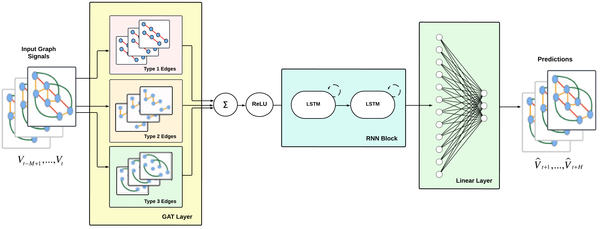

For traffic speed prediction, we adopt the **Spatial-Temporal Graph Attention Network (ST-GAT)** proposed by [Zhang, Yu, and Liu (2019)](https://ieeexplore.ieee.org/document/8903252). ST-GAT efficiently integrates spatial relationships and temporal variations within the network, enabling precise traffic forecasting. Two variants of ST-GAT are introduced in our graph implementations: **ST-GAT Single Edge** and **ST-GAT Edge Type**.

### ST-GAT Single Edge:

- Considers all edge types as the same. 
- Utilizes a **Graph Attention (GAT)** layer to aggregate neighboring node features in a linear manner which enhances traditional Graph Convolutional Networks (GCN) with self-attention mechanisms.
- Employs two **Long Short-Term Memory (LSTM)** layers for capturing temporal characteristics.
- Employs a **linear output** layer for generating traffic speed forecasts.

### ST-GAT Edge Type:

- Segregates graph signals based on edge types to discern their importance.
- Applies a **GAT** layer independently to each edge type for unique feature embeddings.
- Utilizes two **LSTM** layers for capturing temporal dependencies.
- Employs a **linear output** layer for generating traffic speed forecasts.

### Graph Descriptions:

  | Graph             | Node Features                      | Edge Types Included | Edge Types Learned |
|-------------------|------------------------------------|---------------------|---------------------|
| Graph1_SingleEdge | Speed                              | 1                   | Not Learned         |
| Graph2_SingleEdge | Speed                              | 1,2                 | Not Learned         |
| Graph3_SingleEdge | Speed                              | 1,2,3               | Not Learned         |
| Graph4_SingleEdge | Speed, Lanes, Day of Week, Hour of Day | 1                   | Not Learned         |
| Graph5_SingleEdge | Speed, Lanes, Day of Week, Hour of Day | 1,2                 | Not Learned         |
| Graph6_SingleEdge | Speed, Lanes, Day of Week, Hour of Day | 1,2,3               | Not Learned         |
| Graph1_EdgeType   | Speed                              | 1                   | Learned             |
| Graph2_EdgeType   | Speed                              | 1,2                 | Learned             |
| Graph3_EdgeType   | Speed                              | 1,2,3               | Learned             |
| Graph4_EdgeType   | Speed, Lanes, Day of Week, Hour of Day | 1                   | Learned             |
| Graph5_EdgeType   | Speed, Lanes, Day of Week, Hour of Day | 1,2                 | Learned             |
| Graph6_EdgeType   | Speed, Lanes, Day of Week, Hour of Day | 1,2,3               | Learned             |
