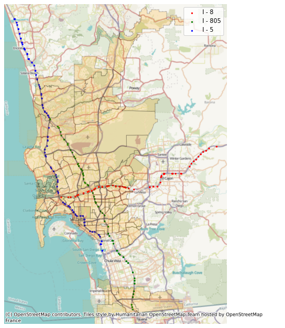

- Leveraged **California's Performance Measurement System** (PeMS), to manually extract data from sensors stations on San Diego County's 3 main highway systems over a restricted time period of 14 days with 5-minute intervals
- Found connectivity and calculated distances between sensors using longitude and latitude coordinates in order to construct graphs

