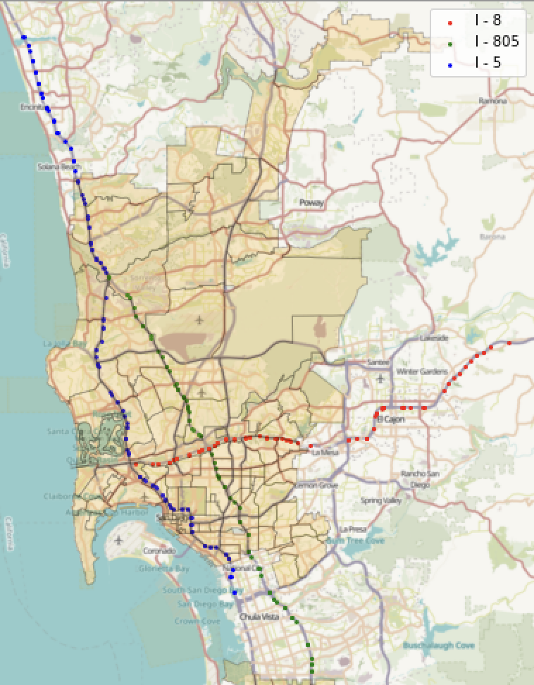

Take a look into our data collection process.

- Leveraged **[California's Performance Measurement System (PeMS)](https://pems.dot.ca.gov/?fwy=805&dir=N&dnode=search&content=cnt_search&center=32.728045%2C-117.1311415&view=e#32.825834,-117.167001,15)**, to manually extract data from sensors stations on San Diego County's 3 main highway systems over a restricted time period of 14 days with 5-minute intervals
- Found connectivity and calculated distances between sensors using longitude and latitude coordinates in order to construct graphs

